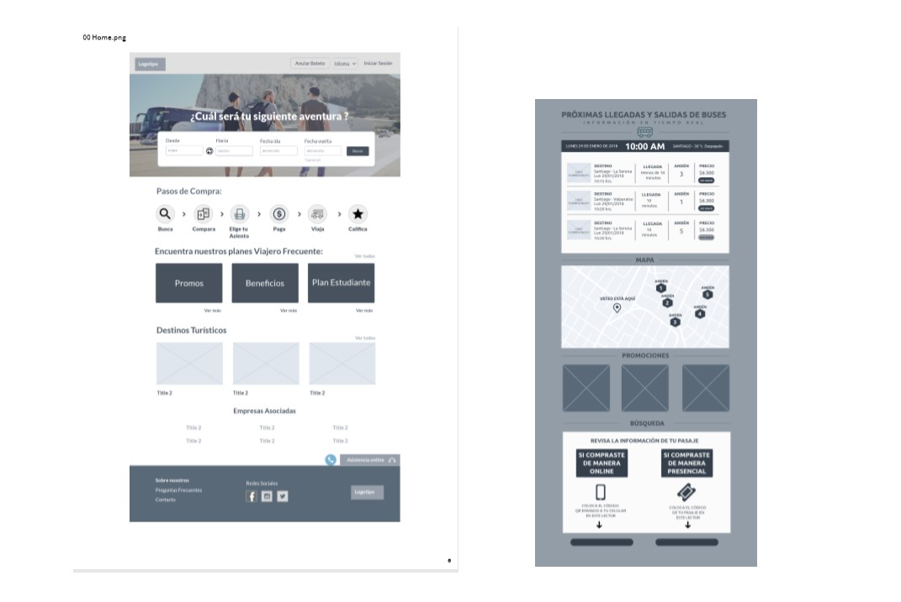
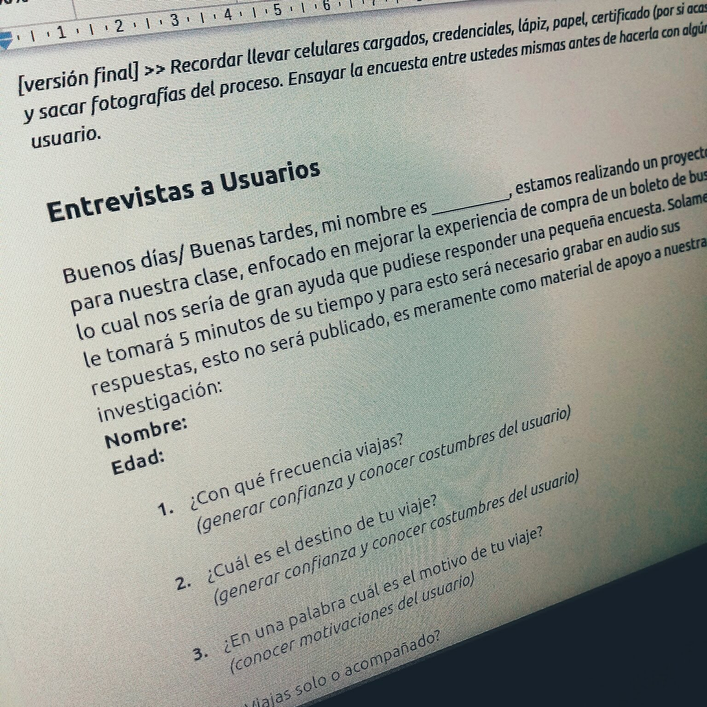
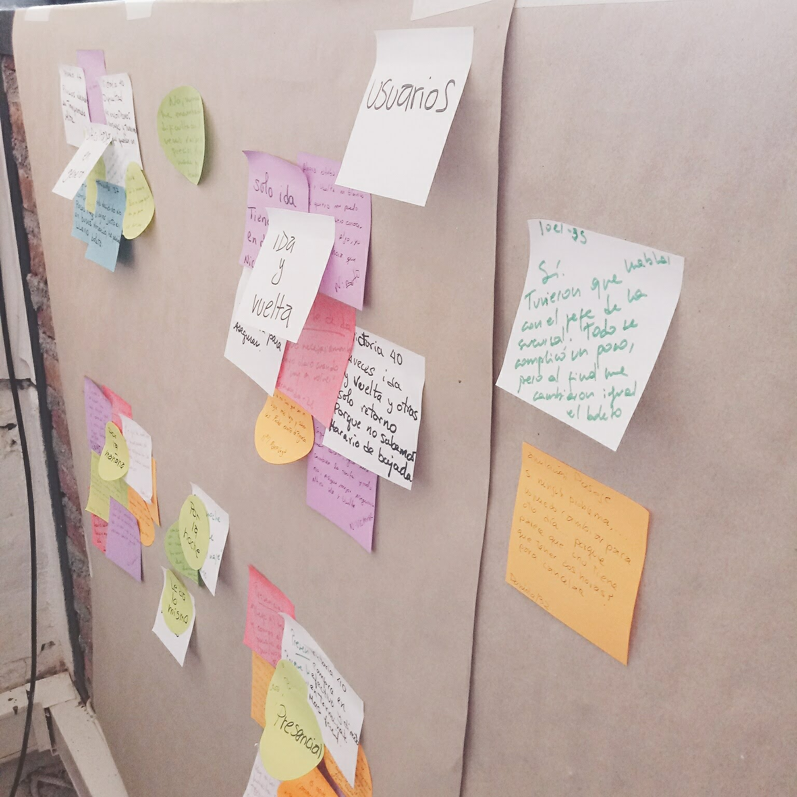
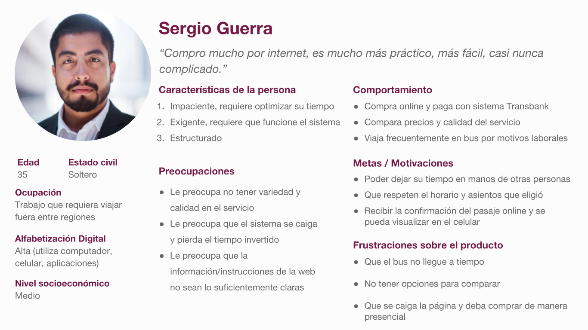
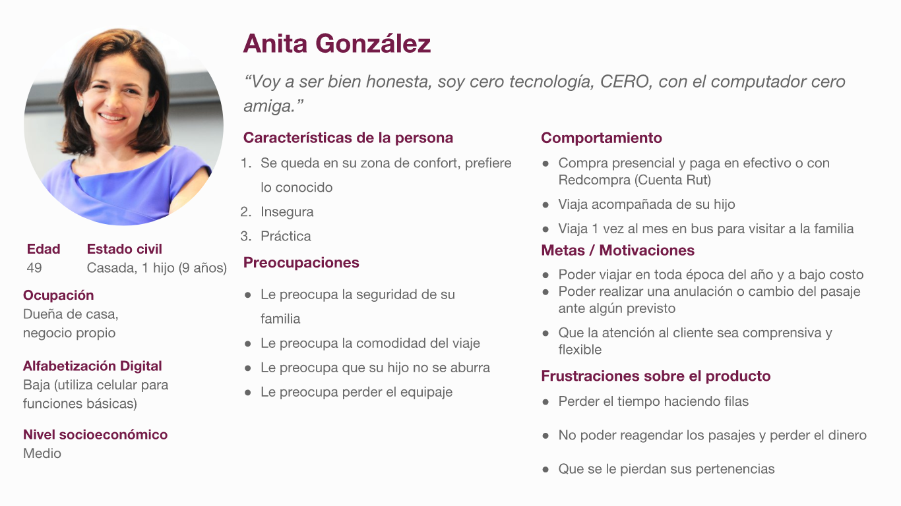
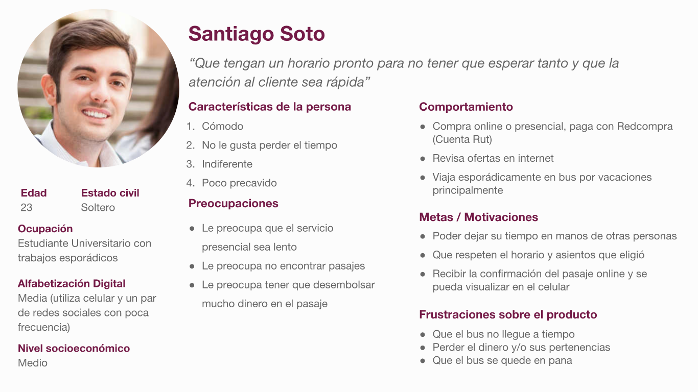
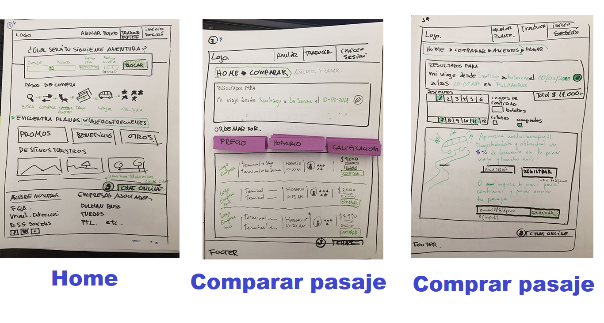
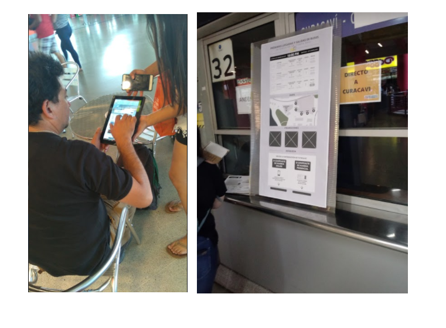

# Empire Bus: Experiencia de usuario en empresas de buses.

## Desarrollado para LABORATORIA

## Objetivos

- Mejorar la experiencia de compra y post-compra de boletos de bus para plataformas digitales.

## ¿Cómo lo hicimos?

- Se desarrollo la solución para un sitio (responsive), donde su enfoque principal es compra de boletos de buses para variadas empresas. En el se podra visualizar las siguientes servicios:

- Una vez comprados serán confirmados vía email o SMS.
- Comparación de precios entre compañias.
- La posibilidad de cambio o anulación de los pasajes (telefónicamente o de manera online).
- Los usuarios se podrán registrar para tener una serie de beneficios y la posibilidad de comentar y evaluar el servicio.
- Además el uso de un totem en el sector de andenes en el terminal de buses que pueda dar orientación sobre la ubicación y llegada de buses, horarios de salidas y llegadas, e información acerca del pasaje comprado por el usuario.

## ¿Cómo llegamos a la solución?

## Proceso

**Investigación**
Realizamos entrevistas en terreno y encuestas online enfocadas a obtener la mayor cantidad posible de información respecto a las problematicas y necesidades de los usuarios en el momento de utilizar los servicios digitales en su proceso de compra.

**Sintesis**

 Una vez reunida la información realizamos un mapa de afinidad donde identificamos las siguientes necesidades:

- que fuera una compra fácil y rápida.
- Que hubiera una forma de confirmación del viaje(compra online).
- Claridad de la información.
- Información accesible de ofertas de pasajes.
- Que los Buses lleguen a la hora indicada en los andenes.
- Que las madres puedan entreter a sus hijos durante la espera del bus en general quieren un viaje confortable.

**A partir de estas necesidades definimos los siguientes objetivos de la plataforma:**

- Agilizar el proceso de compra y anulación de pasajes de bus, a la vez de poder realizar un feedback del servicio mediante una calificación.
- Disminuir la incertidumbre provocada por la espera de buses y/o dificultad en la ubicación de éstos al llegar a su respectivo andén.

**Ideación**

Tomamos a los usuarios más representativos para realizar nuesto user persona:

**Técnicas de Brain Storming**
- Realizamos un ejercicio en equipo de Problem Statement, HWM y What If, en donde nos enfocamoss en el usuario que más exigencias requería al momento de comprar pasajes de buses y con más posibilidades de resolver a través de una solución digital, en este caso Sergio Guerra.

- Concluimos desarrollar una plataforma web para la venta de pasajes online en donde los usuarios puedan comprar en cualquier momento y lugar donde se pueda acceder a toda la información de pasajes disponibles por distintas compañías. Este sitio web estaría complementado con un totem localizado en los andenes que entregara información de los buses que entran y salen, su correpondiente viaje, e información del pasaje.

(colocar imagenes de Problemnt Statement, what if, etc)

**Sketch**

- También comenzamos con el proceso de diseño, donde todo el equipo realizo stketch y se votó por las mejores ideas para poner a prueba en el desarrollo del testing.

SKETCH SELECCIONADO

Luego de escoger el mejor formato realizamos el wireframe de alta fidelidad.

**Wireframes alta fidelidad:**

- Testeamos nuestro wireframe en alta resolución mediante guerrilla testing en el terminal de buses de San Borja, luego iteramos a una segunda versión con algunos aspectos mejorados:

[LINK WIREFRAME TOTEM V.1 MARVEL APP](https://marvelapp.com/36ef2b0/screen/37746896)
- Totem informativo.
- Opción de imprimir y ver información de mi pasaje.

 [LINK WIREFRAME WEB V.1 MARVEL APP](https://marvelapp.com/36ef2b0/screen/37748504)
- Comparar y comprar pasajes de buses en web.
- Elegir pasajes login para ser socio preferencial

[LINK WIREFRAME TOTEM V.2 MARVEL APP](https://marvelapp.com/7h7a14h/screen/38130994)
- Totem con opción idioma ingles.
- Diseño de pasaje impreso por el totem y mejoras en la información que muestra(mapa de anden, horario de viajes)
- Mejoras en la entrega de información en general.

[LINK WIREFRAME WEB V.2 MARVEL APP](https://marvelapp.com/7h7a14h/screen/38131000)
- Mejoras en la entrega de información en general.
- Opción de calificar el viaje realizado según estándares como calidad del bus, atención del chofer, cumplimiento de horarios de los viajes.
- Login de perfil de usuario con listado de viajes realizados y pendientes.
- Opción de Anular o reagendar pasajes desde la web.

**Conclusión**
En el proceso de testing se pudo validar nuestra investigación y cumplir nuestrs objetivos. El testing se realizo en el terminal San Borja en donde gracias a la opinión de los usuarios pudimos iterar nuestro producto, alcanzado las espectativas necesarias para suplir las necesidades de nuestros usuarios.

